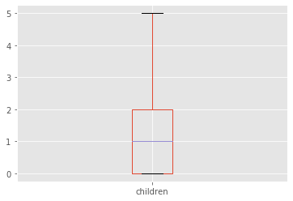
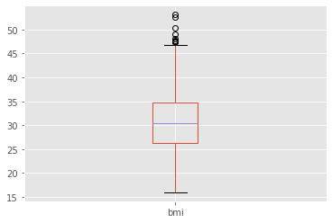
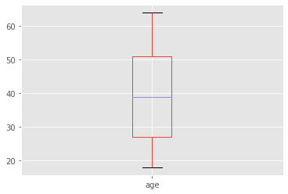
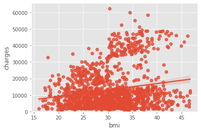
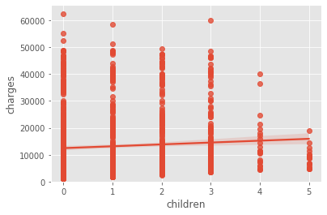

<h3>Importing Relevant Libraries</h3>


```python
# import pandas library
import pandas as pd
import numpy as np # useful for many scientific computing in Python
import pandas as pd # primary data structure library
import matplotlib as mpl
import matplotlib.pyplot as plt
mpl.style.use('ggplot') # optional: for ggplot-like style
import matplotlib.pyplot as plt
%matplotlib inline 
import seaborn as sns
from scipy import stats
```

<h3>Loading Dataset</h3>


```python
df = pd.read_csv("insurance.csv")
df.head()
```


<div>
<style scoped>
    .dataframe tbody tr th:only-of-type {
        vertical-align: middle;
    }

    .dataframe tbody tr th {
        vertical-align: top;
    }

    .dataframe thead th {
        text-align: right;
    }
</style>
<table border="1" class="dataframe">
  <thead>
    <tr style="text-align: right;">
      <th></th>
      <th>age</th>
      <th>sex</th>
      <th>bmi</th>
      <th>children</th>
      <th>smoker</th>
      <th>region</th>
      <th>charges</th>
    </tr>
  </thead>
  <tbody>
    <tr>
      <th>0</th>
      <td>19</td>
      <td>female</td>
      <td>27.900</td>
      <td>0</td>
      <td>yes</td>
      <td>southwest</td>
      <td>16884.92400</td>
    </tr>
    <tr>
      <th>1</th>
      <td>18</td>
      <td>male</td>
      <td>33.770</td>
      <td>1</td>
      <td>no</td>
      <td>southeast</td>
      <td>1725.55230</td>
    </tr>
    <tr>
      <th>2</th>
      <td>28</td>
      <td>male</td>
      <td>33.000</td>
      <td>3</td>
      <td>no</td>
      <td>southeast</td>
      <td>4449.46200</td>
    </tr>
    <tr>
      <th>3</th>
      <td>33</td>
      <td>male</td>
      <td>22.705</td>
      <td>0</td>
      <td>no</td>
      <td>northwest</td>
      <td>21984.47061</td>
    </tr>
    <tr>
      <th>4</th>
      <td>32</td>
      <td>male</td>
      <td>28.880</td>
      <td>0</td>
      <td>no</td>
      <td>northwest</td>
      <td>3866.85520</td>
    </tr>
  </tbody>
</table>
</div>


<h3>Data Cleansing</h3>


```python
df.dtypes
```


    age           int64
    sex          object
    bmi         float64
    children      int64
    smoker       object
    region       object
    charges     float64
    dtype: object


```python
df.describe()
```


<div>
<style scoped>
    .dataframe tbody tr th:only-of-type {
        vertical-align: middle;
    }

    .dataframe tbody tr th {
        vertical-align: top;
    }

    .dataframe thead th {
        text-align: right;
    }
</style>
<table border="1" class="dataframe">
  <thead>
    <tr style="text-align: right;">
      <th></th>
      <th>age</th>
      <th>bmi</th>
      <th>children</th>
      <th>charges</th>
    </tr>
  </thead>
  <tbody>
    <tr>
      <th>count</th>
      <td>1338.000000</td>
      <td>1338.000000</td>
      <td>1338.000000</td>
      <td>1338.000000</td>
    </tr>
    <tr>
      <th>mean</th>
      <td>39.207025</td>
      <td>30.663397</td>
      <td>1.094918</td>
      <td>13270.422265</td>
    </tr>
    <tr>
      <th>std</th>
      <td>14.049960</td>
      <td>6.098187</td>
      <td>1.205493</td>
      <td>12110.011237</td>
    </tr>
    <tr>
      <th>min</th>
      <td>18.000000</td>
      <td>15.960000</td>
      <td>0.000000</td>
      <td>1121.873900</td>
    </tr>
    <tr>
      <th>25%</th>
      <td>27.000000</td>
      <td>26.296250</td>
      <td>0.000000</td>
      <td>4740.287150</td>
    </tr>
    <tr>
      <th>50%</th>
      <td>39.000000</td>
      <td>30.400000</td>
      <td>1.000000</td>
      <td>9382.033000</td>
    </tr>
    <tr>
      <th>75%</th>
      <td>51.000000</td>
      <td>34.693750</td>
      <td>2.000000</td>
      <td>16639.912515</td>
    </tr>
    <tr>
      <th>max</th>
      <td>64.000000</td>
      <td>53.130000</td>
      <td>5.000000</td>
      <td>63770.428010</td>
    </tr>
  </tbody>
</table>
</div>


<h4>Checking for null values</h4>


```python
missing_data = df.isnull()
for column in missing_data.columns.values.tolist():
    print(column)
    print (missing_data[column].value_counts())
    print("")
```

    age
    False    1338
    Name: age, dtype: int64
    
    sex
    False    1338
    Name: sex, dtype: int64
    
    bmi
    False    1338
    Name: bmi, dtype: int64
    
    children
    False    1338
    Name: children, dtype: int64
    
    smoker
    False    1338
    Name: smoker, dtype: int64
    
    region
    False    1338
    Name: region, dtype: int64
    
    charges
    False    1338
    Name: charges, dtype: int64
    


```python
boxplot = df.boxplot(column=['children'])
plt.show()
```





```python
df_children = df.groupby(['children']).size().reset_index(name = 'Total Number Of Children')
df_children
```


<div>
<style scoped>
    .dataframe tbody tr th:only-of-type {
        vertical-align: middle;
    }

    .dataframe tbody tr th {
        vertical-align: top;
    }

    .dataframe thead th {
        text-align: right;
    }
</style>
<table border="1" class="dataframe">
  <thead>
    <tr style="text-align: right;">
      <th></th>
      <th>children</th>
      <th>Total Number Of Children</th>
    </tr>
  </thead>
  <tbody>
    <tr>
      <th>0</th>
      <td>0</td>
      <td>574</td>
    </tr>
    <tr>
      <th>1</th>
      <td>1</td>
      <td>324</td>
    </tr>
    <tr>
      <th>2</th>
      <td>2</td>
      <td>240</td>
    </tr>
    <tr>
      <th>3</th>
      <td>3</td>
      <td>157</td>
    </tr>
    <tr>
      <th>4</th>
      <td>4</td>
      <td>25</td>
    </tr>
    <tr>
      <th>5</th>
      <td>5</td>
      <td>18</td>
    </tr>
  </tbody>
</table>
</div>


```python
boxplot = df.boxplot(column=['bmi'])
plt.show()
```





```python
df['bmi'].describe()
```


    count    1338.000000
    mean       30.663397
    std         6.098187
    min        15.960000
    25%        26.296250
    50%        30.400000
    75%        34.693750
    max        53.130000
    Name: bmi, dtype: float64


```python
sorted(df['bmi'])
```


    [15.96,
     16.815,
     16.815,
     17.195,
     17.29,
     17.29,
     17.29,
     17.385,
     17.4,
     17.48,
     17.67,
     17.765,
     17.8,
     17.86,
     17.955,
     18.05,
     18.3,
     18.335,
     18.335,
     18.335,
     18.5,
     18.6,
     18.715,
     18.905,
     19.0,
     19.095,
     19.19,
     19.3,
     19.475,
     19.57,
     19.8,
     19.8,
     19.8,
     19.855,
     19.855,
     19.95,
     19.95,
     19.95,
     19.95,
     19.95,
     19.95,
     20.045,
     20.045,
     20.1,
     20.13,
     20.235,
     20.235,
     20.235,
     20.235,
     20.3,
     20.35,
     20.4,
     20.425,
     20.52,
     20.52,
     20.6,
     20.6,
     20.615,
     20.7,
     20.79,
     20.8,
     20.8,
     20.9,
     20.9,
     21.01,
     21.09,
     21.12,
     21.28,
     21.3,
     21.375,
     21.375,
     21.4,
     21.4,
     21.47,
     21.47,
     21.47,
     21.5,
     21.56,
     21.565,
     21.66,
     21.66,
     21.66,
     21.7,
     21.755,
     21.755,
     21.755,
     21.755,
     21.78,
     21.78,
     21.8,
     21.85,
     21.85,
     21.85,
     21.85,
     21.89,
     21.945,
     22.0,
     22.04,
     22.1,
     22.135,
     22.135,
     22.135,
     22.135,
     22.22,
     22.23,
     22.23,
     22.3,
     22.3,
     22.42,
     22.42,
     22.42,
     22.515,
     22.515,
     22.515,
     22.515,
     22.515,
     22.6,
     22.6,
     22.61,
     22.61,
     22.61,
     22.61,
     22.705,
     22.705,
     22.705,
     22.77,
     22.8,
     22.8,
     22.88,
     22.895,
     22.895,
     22.895,
     22.895,
     22.99,
     22.99,
     22.99,
     23.0,
     23.085,
     23.085,
     23.1,
     23.18,
     23.18,
     23.18,
     23.18,
     23.18,
     23.2,
     23.21,
     23.21,
     23.21,
     23.21,
     23.21,
     23.275,
     23.3,
     23.32,
     23.37,
     23.37,
     23.37,
     23.4,
     23.4,
     23.465,
     23.465,
     23.54,
     23.56,
     23.56,
     23.6,
     23.6,
     23.65,
     23.655,
     23.655,
     23.655,
     23.655,
     23.655,
     23.7,
     23.7,
     23.75,
     23.75,
     23.75,
     23.76,
     23.8,
     23.845,
     23.845,
     23.845,
     23.87,
     23.9,
     23.94,
     23.98,
     23.98,
     23.98,
     24.035,
     24.035,
     24.035,
     24.09,
     24.1,
     24.1,
     24.13,
     24.13,
     24.13,
     24.13,
     24.225,
     24.225,
     24.225,
     24.3,
     24.3,
     24.3,
     24.31,
     24.31,
     24.32,
     24.32,
     24.32,
     24.32,
     24.32,
     24.32,
     24.32,
     24.4,
     24.415,
     24.42,
     24.42,
     24.42,
     24.51,
     24.51,
     24.51,
     24.53,
     24.6,
     24.6,
     24.6,
     24.605,
     24.605,
     24.605,
     24.605,
     24.64,
     24.7,
     24.7,
     24.7,
     24.7,
     24.75,
     24.795,
     24.795,
     24.795,
     24.795,
     24.86,
     24.86,
     24.89,
     24.97,
     24.985,
     24.985,
     25.0,
     25.0,
     25.08,
     25.08,
     25.08,
     25.08,
     25.08,
     25.1,
     25.175,
     25.175,
     25.175,
     25.175,
     25.175,
     25.175,
     25.2,
     25.27,
     25.27,
     25.27,
     25.3,
     25.3,
     25.3,
     25.3,
     25.3,
     25.365,
     25.365,
     25.365,
     25.4,
     25.41,
     25.46,
     25.46,
     25.46,
     25.46,
     25.46,
     25.46,
     25.46,
     25.52,
     25.555,
     25.555,
     25.555,
     25.6,
     25.6,
     25.6,
     25.6,
     25.65,
     25.7,
     25.7,
     25.74,
     25.74,
     25.74,
     25.74,
     25.745,
     25.745,
     25.745,
     25.8,
     25.8,
     25.8,
     25.8,
     25.8,
     25.8,
     25.8,
     25.84,
     25.84,
     25.84,
     25.84,
     25.84,
     25.85,
     25.9,
     25.9,
     25.9,
     25.935,
     25.935,
     25.935,
     26.03,
     26.03,
     26.03,
     26.03,
     26.03,
     26.07,
     26.125,
     26.125,
     26.125,
     26.125,
     26.18,
     26.18,
     26.2,
     26.22,
     26.22,
     26.22,
     26.22,
     26.29,
     26.315,
     26.315,
     26.315,
     26.315,
     26.315,
     26.4,
     26.4,
     26.4,
     26.4,
     26.41,
     26.41,
     26.41,
     26.41,
     26.41,
     26.41,
     26.505,
     26.51,
     26.51,
     26.6,
     26.6,
     26.6,
     26.6,
     26.6,
     26.6,
     26.62,
     26.62,
     26.695,
     26.695,
     26.695,
     26.695,
     26.695,
     26.7,
     26.7,
     26.73,
     26.73,
     26.79,
     26.79,
     26.8,
     26.8,
     26.84,
     26.84,
     26.885,
     26.885,
     26.885,
     26.885,
     26.9,
     26.98,
     26.98,
     26.98,
     27.0,
     27.06,
     27.075,
     27.1,
     27.1,
     27.1,
     27.1,
     27.17,
     27.17,
     27.2,
     27.2,
     27.265,
     27.265,
     27.265,
     27.265,
     27.28,
     27.3,
     27.36,
     27.36,
     27.36,
     27.36,
     27.36,
     27.36,
     27.36,
     27.4,
     27.4,
     27.455,
     27.455,
     27.5,
     27.5,
     27.5,
     27.5,
     27.5,
     27.5,
     27.55,
     27.55,
     27.55,
     27.55,
     27.6,
     27.6,
     27.6,
     27.6,
     27.6,
     27.61,
     27.645,
     27.645,
     27.645,
     27.645,
     27.645,
     27.645,
     27.645,
     27.7,
     27.7,
     27.7,
     27.72,
     27.72,
     27.72,
     27.72,
     27.74,
     27.74,
     27.74,
     27.74,
     27.74,
     27.74,
     27.8,
     27.83,
     27.83,
     27.83,
     27.83,
     27.835,
     27.835,
     27.835,
     27.835,
     27.835,
     27.9,
     27.93,
     27.93,
     27.93,
     27.93,
     27.94,
     27.94,
     27.94,
     28.0,
     28.0,
     28.0,
     28.025,
     28.025,
     28.025,
     28.025,
     28.025,
     28.05,
     28.05,
     28.05,
     28.1,
     28.1,
     28.12,
     28.12,
     28.12,
     28.12,
     28.16,
     28.2,
     28.215,
     28.215,
     28.215,
     28.215,
     28.27,
     28.27,
     28.3,
     28.3,
     28.31,
     28.31,
     28.31,
     28.31,
     28.31,
     28.31,
     28.31,
     28.31,
     28.31,
     28.38,
     28.4,
     28.4,
     28.405,
     28.405,
     28.49,
     28.5,
     28.5,
     28.5,
     28.5,
     28.5,
     28.595,
     28.595,
     28.595,
     28.595,
     28.595,
     28.595,
     28.6,
     28.6,
     28.6,
     28.69,
     28.69,
     28.69,
     28.7,
     28.7,
     28.7,
     28.7,
     28.7,
     28.785,
     28.785,
     28.785,
     28.785,
     28.785,
     28.8,
     28.82,
     28.88,
     28.88,
     28.88,
     28.88,
     28.88,
     28.88,
     28.88,
     28.88,
     28.9,
     28.9,
     28.9,
     28.9,
     28.9,
     28.93,
     28.93,
     28.93,
     28.975,
     28.975,
     28.975,
     28.975,
     28.975,
     29.0,
     29.0,
     29.04,
     29.07,
     29.07,
     29.1,
     29.15,
     29.15,
     29.165,
     29.2,
     29.26,
     29.26,
     29.26,
     29.26,
     29.3,
     29.3,
     29.355,
     29.355,
     29.37,
     29.37,
     29.4,
     29.45,
     29.48,
     29.48,
     29.48,
     29.5,
     29.545,
     29.59,
     29.59,
     29.6,
     29.6,
     29.6,
     29.6,
     29.64,
     29.64,
     29.64,
     29.64,
     29.64,
     29.7,
     29.7,
     29.7,
     29.7,
     29.7,
     29.735,
     29.735,
     29.735,
     29.735,
     29.8,
     29.8,
     29.8,
     29.8,
     29.81,
     29.81,
     29.81,
     29.81,
     29.83,
     29.83,
     29.83,
     29.83,
     29.83,
     29.83,
     29.9,
     29.9,
     29.9,
     29.92,
     29.92,
     29.92,
     29.92,
     29.92,
     29.92,
     29.925,
     29.925,
     29.925,
     30.0,
     30.0,
     30.02,
     30.02,
     30.02,
     30.02,
     30.03,
     30.03,
     30.03,
     30.1,
     30.1,
     30.115,
     30.115,
     30.115,
     30.115,
     30.115,
     30.115,
     30.14,
     30.14,
     30.2,
     30.2,
     30.2,
     30.2,
     30.2,
     30.2,
     30.21,
     30.21,
     30.21,
     30.21,
     30.25,
     30.25,
     30.3,
     30.3,
     30.3,
     30.305,
     30.305,
     30.36,
     30.4,
     30.4,
     30.4,
     30.4,
     30.4,
     30.495,
     30.495,
     30.495,
     30.495,
     30.495,
     30.495,
     30.495,
     30.495,
     30.5,
     30.5,
     30.5,
     30.5,
     30.59,
     30.59,
     30.59,
     30.59,
     30.59,
     30.59,
     30.59,
     30.685,
     30.685,
     30.685,
     30.69,
     30.69,
     30.78,
     30.78,
     30.78,
     30.78,
     30.78,
     30.8,
     30.8,
     30.8,
     30.8,
     30.8,
     30.8,
     30.8,
     30.8,
     30.875,
     30.875,
     30.875,
     30.875,
     30.875,
     30.875,
     30.875,
     30.875,
     30.9,
     30.9,
     30.9,
     30.97,
     31.0,
     31.0,
     31.02,
     31.02,
     31.02,
     31.065,
     31.065,
     31.065,
     31.065,
     31.1,
     31.13,
     31.13,
     31.13,
     31.13,
     31.16,
     31.16,
     31.16,
     31.16,
     31.2,
     31.24,
     31.255,
     31.255,
     31.255,
     31.3,
     31.35,
     31.35,
     31.35,
     31.35,
     31.35,
     31.35,
     31.35,
     31.35,
     31.4,
     31.4,
     31.4,
     31.445,
     31.445,
     31.46,
     31.46,
     31.5,
     31.5,
     31.54,
     31.54,
     31.57,
     31.57,
     31.6,
     31.6,
     31.6,
     31.635,
     31.635,
     31.68,
     31.68,
     31.73,
     31.73,
     31.73,
     31.73,
     31.73,
     31.73,
     31.79,
     31.79,
     31.79,
     31.79,
     31.8,
     31.825,
     31.825,
     31.825,
     31.825,
     31.825,
     31.9,
     31.9,
     31.9,
     31.92,
     31.92,
     31.92,
     31.92,
     31.92,
     32.0,
     32.01,
     32.01,
     32.015,
     32.015,
     32.1,
     32.11,
     32.11,
     32.11,
     32.11,
     32.11,
     32.11,
     32.11,
     32.12,
     32.2,
     32.2,
     32.2,
     32.205,
     32.205,
     32.23,
     32.23,
     32.3,
     32.3,
     32.3,
     32.3,
     32.3,
     32.3,
     32.3,
     32.3,
     32.3,
     32.3,
     32.3,
     32.3,
     32.3,
     32.34,
     32.34,
     32.395,
     32.395,
     32.395,
     32.395,
     32.395,
     32.4,
     32.45,
     32.49,
     32.49,
     32.5,
     32.56,
     32.56,
     32.585,
     32.6,
     32.6,
     32.67,
     32.67,
     32.68,
     32.68,
     32.68,
     32.68,
     32.7,
     32.7,
     32.775,
     32.775,
     32.775,
     32.775,
     32.775,
     32.775,
     32.775,
     32.78,
     32.8,
     32.8,
     32.8,
     32.87,
     32.9,
     32.9,
     32.9,
     32.965,
     32.965,
     32.965,
     32.965,
     33.0,
     33.0,
     33.0,
     33.0,
     33.0,
     33.0,
     33.06,
     33.1,
     33.1,
     33.1,
     33.1,
     33.11,
     33.11,
     33.11,
     33.11,
     33.155,
     33.155,
     33.155,
     33.155,
     33.155,
     33.2,
     33.25,
     33.25,
     33.25,
     33.3,
     33.3,
     33.33,
     33.33,
     33.33,
     33.33,
     33.33,
     33.33,
     33.33,
     33.345,
     33.345,
     33.345,
     33.345,
     33.345,
     33.4,
     33.4,
     33.4,
     33.44,
     33.44,
     33.44,
     33.44,
     33.5,
     33.535,
     33.535,
     33.535,
     33.55,
     33.63,
     33.63,
     33.63,
     33.63,
     33.63,
     33.63,
     33.66,
     33.66,
     33.66,
     33.66,
     33.66,
     33.7,
     33.7,
     33.7,
     33.725,
     33.725,
     33.77,
     33.77,
     33.8,
     33.82,
     33.82,
     33.82,
     33.82,
     33.88,
     33.88,
     33.88,
     33.915,
     33.915,
     33.915,
     33.915,
     33.99,
     33.99,
     34.01,
     34.1,
     34.1,
     34.1,
     34.1,
     34.1,
     34.1,
     34.1,
     34.1,
     34.105,
     34.105,
     34.105,
     34.105,
     34.2,
     34.2,
     34.2,
     34.2,
     34.2,
     34.21,
     34.21,
     34.21,
     34.21,
     34.295,
     34.3,
     34.32,
     34.32,
     34.32,
     34.39,
     34.39,
     34.4,
     34.4,
     34.4,
     34.4,
     34.43,
     34.43,
     34.43,
     34.43,
     34.485,
     34.485,
     34.5,
     34.58,
     34.58,
     ...]


```python
q1, q3= np.percentile(df['bmi'],[25,75])
iqr = q3 - q1
lower_bound = q1 -(1.5 * iqr)
upper_bound = q3 +(1.5 * iqr) 
print("The lower bound is", lower_bound)
print("The upper bound is", upper_bound)
```

    The lower bound is 13.7
    The upper bound is 47.290000000000006


```python
df_bmi = df.groupby(['bmi']).size().reset_index(name = 'BMI Distribution')
df_bmi_high = df.loc[df['bmi'] >= 47.290000000000006]
df_bmi_high
```


<div>
<style scoped>
    .dataframe tbody tr th:only-of-type {
        vertical-align: middle;
    }

    .dataframe tbody tr th {
        vertical-align: top;
    }

    .dataframe thead th {
        text-align: right;
    }
</style>
<table border="1" class="dataframe">
  <thead>
    <tr style="text-align: right;">
      <th></th>
      <th>age</th>
      <th>sex</th>
      <th>bmi</th>
      <th>children</th>
      <th>smoker</th>
      <th>region</th>
      <th>charges</th>
    </tr>
  </thead>
  <tbody>
    <tr>
      <th>116</th>
      <td>58</td>
      <td>male</td>
      <td>49.06</td>
      <td>0</td>
      <td>no</td>
      <td>southeast</td>
      <td>11381.32540</td>
    </tr>
    <tr>
      <th>286</th>
      <td>46</td>
      <td>female</td>
      <td>48.07</td>
      <td>2</td>
      <td>no</td>
      <td>northeast</td>
      <td>9432.92530</td>
    </tr>
    <tr>
      <th>401</th>
      <td>47</td>
      <td>male</td>
      <td>47.52</td>
      <td>1</td>
      <td>no</td>
      <td>southeast</td>
      <td>8083.91980</td>
    </tr>
    <tr>
      <th>543</th>
      <td>54</td>
      <td>female</td>
      <td>47.41</td>
      <td>0</td>
      <td>yes</td>
      <td>southeast</td>
      <td>63770.42801</td>
    </tr>
    <tr>
      <th>847</th>
      <td>23</td>
      <td>male</td>
      <td>50.38</td>
      <td>1</td>
      <td>no</td>
      <td>southeast</td>
      <td>2438.05520</td>
    </tr>
    <tr>
      <th>860</th>
      <td>37</td>
      <td>female</td>
      <td>47.60</td>
      <td>2</td>
      <td>yes</td>
      <td>southwest</td>
      <td>46113.51100</td>
    </tr>
    <tr>
      <th>1047</th>
      <td>22</td>
      <td>male</td>
      <td>52.58</td>
      <td>1</td>
      <td>yes</td>
      <td>southeast</td>
      <td>44501.39820</td>
    </tr>
    <tr>
      <th>1088</th>
      <td>52</td>
      <td>male</td>
      <td>47.74</td>
      <td>1</td>
      <td>no</td>
      <td>southeast</td>
      <td>9748.91060</td>
    </tr>
    <tr>
      <th>1317</th>
      <td>18</td>
      <td>male</td>
      <td>53.13</td>
      <td>0</td>
      <td>no</td>
      <td>southeast</td>
      <td>1163.46270</td>
    </tr>
  </tbody>
</table>
</div>


```python
df = df.drop(df.index[(df['bmi'] > 47.290000000000006)])
```


```python
boxplot = df.boxplot(column=['bmi'])
plt.show()
```





```python
boxplot = df.boxplot(column=['age'])
plt.show()
```


<h3> Finding Most Relevant Features </h3>

<h4>Continuous Variables</h4>


```python
#Calculate the correlation between variables
df.corr()
```


<div>
<style scoped>
    .dataframe tbody tr th:only-of-type {
        vertical-align: middle;
    }

    .dataframe tbody tr th {
        vertical-align: top;
    }

    .dataframe thead th {
        text-align: right;
    }
</style>
<table border="1" class="dataframe">
  <thead>
    <tr style="text-align: right;">
      <th></th>
      <th>age</th>
      <th>bmi</th>
      <th>children</th>
      <th>charges</th>
    </tr>
  </thead>
  <tbody>
    <tr>
      <th>age</th>
      <td>1.000000</td>
      <td>0.114686</td>
      <td>0.043041</td>
      <td>0.302022</td>
    </tr>
    <tr>
      <th>bmi</th>
      <td>0.114686</td>
      <td>1.000000</td>
      <td>0.017355</td>
      <td>0.193196</td>
    </tr>
    <tr>
      <th>children</th>
      <td>0.043041</td>
      <td>0.017355</td>
      <td>1.000000</td>
      <td>0.069739</td>
    </tr>
    <tr>
      <th>charges</th>
      <td>0.302022</td>
      <td>0.193196</td>
      <td>0.069739</td>
      <td>1.000000</td>
    </tr>
  </tbody>
</table>
</div>


```python
sns.regplot(x="age", y="charges", data=df)
plt.ylim(0,)
```


    (0, 65666.43974376048)


It seems like there is a correlation between age and charges.It also seems that once age increases beyond 30, the charges grow faster.


```python
sns.regplot(x="bmi", y="charges", data=df)
plt.ylim(0,)
```


    (0, 65666.43974376048)





It seems like there is a correlation between BMI and charges.It also seems that once BMI increases beyond 30, the charges grow faster.


```python
sns.regplot(x="children", y="charges", data=df)
plt.ylim(0,)
```


    (0, 65666.43974376048)





There seems to be no correlation between number of children and charges


```python
pearson_coef, p_value = stats.pearsonr(df['age'], df['charges'])
print("The Pearson Correlation Coefficient between charge and age is", pearson_coef, " with a P-value of P =", p_value)
```

    The Pearson Correlation Coefficient between charge and age is 0.3020217839155803  with a P-value of P = 1.9745879636818617e-29


```python
pearson_coef, p_value = stats.pearsonr(df['bmi'], df['charges'])
print("The Pearson Correlation Coefficient between charge and bmi is", pearson_coef, " with a P-value of P =", p_value)
```

    The Pearson Correlation Coefficient between charge and bmi is 0.19319613016496306  with a P-value of P = 1.2168105870380684e-12


```python
pearson_coef, p_value = stats.pearsonr(df['children'], df['charges'])
print("The Pearson Correlation Coefficient between charges and number of childrenis", pearson_coef, " with a P-value of P =", p_value)
```

    The Pearson Correlation Coefficient between charges and number of childrenis 0.06973923212310341  with a P-value of P = 0.010988017451374265


<h4>Categorical Variables</h4>

<h5>Null Hypothesis: Mean charges between all regions are equal.


Alternative Hypothesis:Mean charges between all regions are not equal.</h5>


```python
df_regions=df[['region', 'charges']]
grouped_test2=df_regions.groupby(['region'])
grouped_test2.head(2)
```


<div>
<style scoped>
    .dataframe tbody tr th:only-of-type {
        vertical-align: middle;
    }

    .dataframe tbody tr th {
        vertical-align: top;
    }

    .dataframe thead th {
        text-align: right;
    }
</style>
<table border="1" class="dataframe">
  <thead>
    <tr style="text-align: right;">
      <th></th>
      <th>region</th>
      <th>charges</th>
    </tr>
  </thead>
  <tbody>
    <tr>
      <th>0</th>
      <td>southwest</td>
      <td>16884.92400</td>
    </tr>
    <tr>
      <th>1</th>
      <td>southeast</td>
      <td>1725.55230</td>
    </tr>
    <tr>
      <th>2</th>
      <td>southeast</td>
      <td>4449.46200</td>
    </tr>
    <tr>
      <th>3</th>
      <td>northwest</td>
      <td>21984.47061</td>
    </tr>
    <tr>
      <th>4</th>
      <td>northwest</td>
      <td>3866.85520</td>
    </tr>
    <tr>
      <th>8</th>
      <td>northeast</td>
      <td>6406.41070</td>
    </tr>
    <tr>
      <th>10</th>
      <td>northeast</td>
      <td>2721.32080</td>
    </tr>
    <tr>
      <th>12</th>
      <td>southwest</td>
      <td>1826.84300</td>
    </tr>
  </tbody>
</table>
</div>


```python
f_val, p_val = stats.f_oneway(grouped_test2.get_group('southwest')['charges'], grouped_test2.get_group('southeast')['charges'],grouped_test2.get_group('northwest')['charges'],grouped_test2.get_group('northeast')['charges'])  
 
print( "ANOVA results: F=", f_val, ", P =", p_val)   
```

    ANOVA results: F= 2.8845336097153154 , P = 0.03465713619614703


F value is pretty close to 1, but p value is less than 0.05. This means that we can reject the null hypothesis.

<h5>Null Hypothesis: Mean charges between all smoker statuses are equal.

    
    

Alternative Hypothesis:Mean charges between all smoker statuses are not equal.</h5>


```python
df_smoker=df[['smoker', 'charges']]
grouped_test3=df_smoker.groupby(['smoker'])
grouped_test3.head(2)
```


<div>
<style scoped>
    .dataframe tbody tr th:only-of-type {
        vertical-align: middle;
    }

    .dataframe tbody tr th {
        vertical-align: top;
    }

    .dataframe thead th {
        text-align: right;
    }
</style>
<table border="1" class="dataframe">
  <thead>
    <tr style="text-align: right;">
      <th></th>
      <th>smoker</th>
      <th>charges</th>
    </tr>
  </thead>
  <tbody>
    <tr>
      <th>0</th>
      <td>yes</td>
      <td>16884.9240</td>
    </tr>
    <tr>
      <th>1</th>
      <td>no</td>
      <td>1725.5523</td>
    </tr>
    <tr>
      <th>2</th>
      <td>no</td>
      <td>4449.4620</td>
    </tr>
    <tr>
      <th>11</th>
      <td>yes</td>
      <td>27808.7251</td>
    </tr>
  </tbody>
</table>
</div>


```python
f_val, p_val = stats.f_oneway(grouped_test3.get_group('yes')['charges'], grouped_test3.get_group('no')['charges'])  
 
print( "ANOVA results: F=", f_val, ", P =", p_val)   
```

    ANOVA results: F= 2143.712098499756 , P = 2.5233056105459822e-279


F value is very large, and p value is much smaller than 0.05. This gives us strong evidence to reject the null hypothesis.

<h5>Null Hypothesis: Mean charges between all sexes are equal.

    
    

Alternative Hypothesis:Mean charges between all sexes are not equal.</h5>


```python
df_regions=df[['sex', 'charges']]
grouped_test4=df_regions.groupby(['sex'])
grouped_test4.head(2)
```


<div>
<style scoped>
    .dataframe tbody tr th:only-of-type {
        vertical-align: middle;
    }

    .dataframe tbody tr th {
        vertical-align: top;
    }

    .dataframe thead th {
        text-align: right;
    }
</style>
<table border="1" class="dataframe">
  <thead>
    <tr style="text-align: right;">
      <th></th>
      <th>sex</th>
      <th>charges</th>
    </tr>
  </thead>
  <tbody>
    <tr>
      <th>0</th>
      <td>female</td>
      <td>16884.9240</td>
    </tr>
    <tr>
      <th>1</th>
      <td>male</td>
      <td>1725.5523</td>
    </tr>
    <tr>
      <th>2</th>
      <td>male</td>
      <td>4449.4620</td>
    </tr>
    <tr>
      <th>5</th>
      <td>female</td>
      <td>3756.6216</td>
    </tr>
  </tbody>
</table>
</div>


```python
# ANOVA
f_val, p_val = stats.f_oneway(grouped_test4.get_group('female')['charges'], grouped_test4.get_group('male')['charges'])  
 
print( "ANOVA results: F=", f_val, ", P =", p_val) 
```

    ANOVA results: F= 5.35453965869183 , P = 0.020820522903890002


F value is close to 1 and p value is much smaller than 0.05. This gives us evidence to reject the null hypothesis.

<h3>Feature Evaluation</h3>

For continuous variables, BMI and age are strongly correlated to charges.

For continuous variable, all have an influence on the charges. However, a larger F value is better. It seems that smoker status is the most relevant. However, we will create multiple models which also include sex and region.

