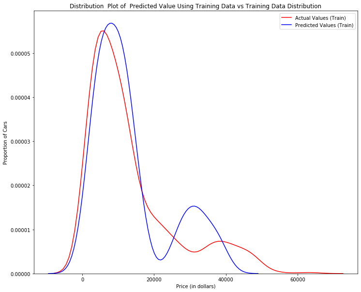
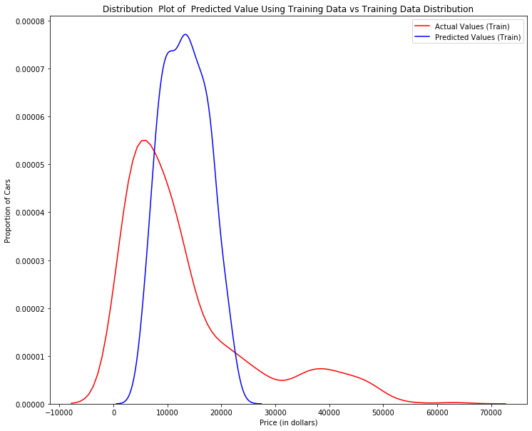
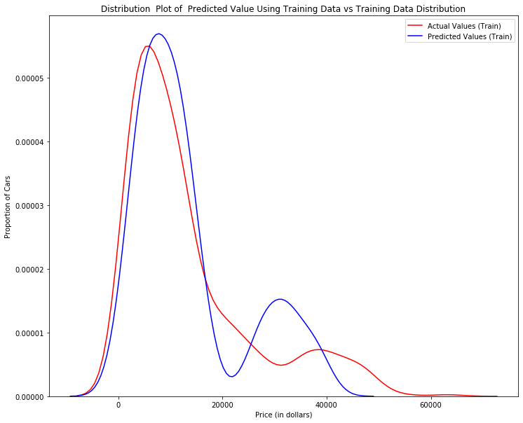

<h3>Importing All the Relevant Libraries</h3>


```python
# import pandas library
import pandas as pd
import numpy as np # useful for many scientific computing in Python
import pandas as pd # primary data structure library
import matplotlib as mpl
import matplotlib.pyplot as plt
from sklearn.metrics import accuracy_score
from sklearn.linear_model import LinearRegression
from sklearn.metrics import mean_squared_error
```


```python
from IPython.display import display
from IPython.html import widgets 
from IPython.display import display
from ipywidgets import interact, interactive, fixed, interact_manual
```


```python
import seaborn as sns
%matplotlib inline 
```


```python
def DistributionPlot(RedFunction, BlueFunction, RedName, BlueName, Title):
    width = 12
    height = 10
    plt.figure(figsize=(width, height))

    ax1 = sns.distplot(RedFunction, hist=False, color="r", label=RedName)
    ax2 = sns.distplot(BlueFunction, hist=False, color="b", label=BlueName, ax=ax1)

    plt.title(Title)
    plt.xlabel('Price (in dollars)')
    plt.ylabel('Proportion of Cars')

    plt.show()
    plt.close()
```

<h3>Loading Dataset</h3>


```python
df = pd.read_csv("insurance.csv")
df.head()
```


<div>
<style scoped>
    .dataframe tbody tr th:only-of-type {
        vertical-align: middle;
    }

    .dataframe tbody tr th {
        vertical-align: top;
    }

    .dataframe thead th {
        text-align: right;
    }
</style>
<table border="1" class="dataframe">
  <thead>
    <tr style="text-align: right;">
      <th></th>
      <th>age</th>
      <th>sex</th>
      <th>bmi</th>
      <th>children</th>
      <th>smoker</th>
      <th>region</th>
      <th>charges</th>
    </tr>
  </thead>
  <tbody>
    <tr>
      <th>0</th>
      <td>19</td>
      <td>female</td>
      <td>27.900</td>
      <td>0</td>
      <td>yes</td>
      <td>southwest</td>
      <td>16884.92400</td>
    </tr>
    <tr>
      <th>1</th>
      <td>18</td>
      <td>male</td>
      <td>33.770</td>
      <td>1</td>
      <td>no</td>
      <td>southeast</td>
      <td>1725.55230</td>
    </tr>
    <tr>
      <th>2</th>
      <td>28</td>
      <td>male</td>
      <td>33.000</td>
      <td>3</td>
      <td>no</td>
      <td>southeast</td>
      <td>4449.46200</td>
    </tr>
    <tr>
      <th>3</th>
      <td>33</td>
      <td>male</td>
      <td>22.705</td>
      <td>0</td>
      <td>no</td>
      <td>northwest</td>
      <td>21984.47061</td>
    </tr>
    <tr>
      <th>4</th>
      <td>32</td>
      <td>male</td>
      <td>28.880</td>
      <td>0</td>
      <td>no</td>
      <td>northwest</td>
      <td>3866.85520</td>
    </tr>
  </tbody>
</table>
</div>


<h3>Dummy Variables</h3>

Creating dummy variables for all the categorical features as we want this to fit into a regression problem


```python
from sklearn import preprocessing
#le = preprocessing.LabelEncoder()
#df[["smoker"]] = le.fit_transform(df[["smoker"]].astype('str'))
dummy_variable_1 = pd.get_dummies(df['smoker'])
dummy_variable_1.rename(columns={'smoker-yes':'yes', 'smoker-yes':'no'}, inplace=True)
dummy_variable_1.head()
df = pd.concat([df, dummy_variable_1], axis=1)
df.drop('smoker', axis = 1, inplace=True)
df['no']= df['no'].astype('int64')
df['yes']= df['yes'].astype('int64')
df.head()
```


<div>
<style scoped>
    .dataframe tbody tr th:only-of-type {
        vertical-align: middle;
    }

    .dataframe tbody tr th {
        vertical-align: top;
    }

    .dataframe thead th {
        text-align: right;
    }
</style>
<table border="1" class="dataframe">
  <thead>
    <tr style="text-align: right;">
      <th></th>
      <th>age</th>
      <th>sex</th>
      <th>bmi</th>
      <th>children</th>
      <th>region</th>
      <th>charges</th>
      <th>no</th>
      <th>yes</th>
    </tr>
  </thead>
  <tbody>
    <tr>
      <th>0</th>
      <td>19</td>
      <td>female</td>
      <td>27.900</td>
      <td>0</td>
      <td>southwest</td>
      <td>16884.92400</td>
      <td>0</td>
      <td>1</td>
    </tr>
    <tr>
      <th>1</th>
      <td>18</td>
      <td>male</td>
      <td>33.770</td>
      <td>1</td>
      <td>southeast</td>
      <td>1725.55230</td>
      <td>1</td>
      <td>0</td>
    </tr>
    <tr>
      <th>2</th>
      <td>28</td>
      <td>male</td>
      <td>33.000</td>
      <td>3</td>
      <td>southeast</td>
      <td>4449.46200</td>
      <td>1</td>
      <td>0</td>
    </tr>
    <tr>
      <th>3</th>
      <td>33</td>
      <td>male</td>
      <td>22.705</td>
      <td>0</td>
      <td>northwest</td>
      <td>21984.47061</td>
      <td>1</td>
      <td>0</td>
    </tr>
    <tr>
      <th>4</th>
      <td>32</td>
      <td>male</td>
      <td>28.880</td>
      <td>0</td>
      <td>northwest</td>
      <td>3866.85520</td>
      <td>1</td>
      <td>0</td>
    </tr>
  </tbody>
</table>
</div>


```python
dummy_variable_2 = pd.get_dummies(df["region"])
dummy_variable_2.rename(columns={'region-southwest':'southwest', 'region-southwest':'southeast',
                                'region-southwest':'northwest','region-southwest':'northeast'}, inplace=True)
dummy_variable_2.head()
df = pd.concat([df, dummy_variable_2], axis=1)
df.drop("region", axis = 1, inplace=True)
df.head()
```


<div>
<style scoped>
    .dataframe tbody tr th:only-of-type {
        vertical-align: middle;
    }

    .dataframe tbody tr th {
        vertical-align: top;
    }

    .dataframe thead th {
        text-align: right;
    }
</style>
<table border="1" class="dataframe">
  <thead>
    <tr style="text-align: right;">
      <th></th>
      <th>age</th>
      <th>sex</th>
      <th>bmi</th>
      <th>children</th>
      <th>charges</th>
      <th>no</th>
      <th>yes</th>
      <th>northeast</th>
      <th>northwest</th>
      <th>southeast</th>
      <th>southwest</th>
    </tr>
  </thead>
  <tbody>
    <tr>
      <th>0</th>
      <td>19</td>
      <td>female</td>
      <td>27.900</td>
      <td>0</td>
      <td>16884.92400</td>
      <td>0</td>
      <td>1</td>
      <td>0</td>
      <td>0</td>
      <td>0</td>
      <td>1</td>
    </tr>
    <tr>
      <th>1</th>
      <td>18</td>
      <td>male</td>
      <td>33.770</td>
      <td>1</td>
      <td>1725.55230</td>
      <td>1</td>
      <td>0</td>
      <td>0</td>
      <td>0</td>
      <td>1</td>
      <td>0</td>
    </tr>
    <tr>
      <th>2</th>
      <td>28</td>
      <td>male</td>
      <td>33.000</td>
      <td>3</td>
      <td>4449.46200</td>
      <td>1</td>
      <td>0</td>
      <td>0</td>
      <td>0</td>
      <td>1</td>
      <td>0</td>
    </tr>
    <tr>
      <th>3</th>
      <td>33</td>
      <td>male</td>
      <td>22.705</td>
      <td>0</td>
      <td>21984.47061</td>
      <td>1</td>
      <td>0</td>
      <td>0</td>
      <td>1</td>
      <td>0</td>
      <td>0</td>
    </tr>
    <tr>
      <th>4</th>
      <td>32</td>
      <td>male</td>
      <td>28.880</td>
      <td>0</td>
      <td>3866.85520</td>
      <td>1</td>
      <td>0</td>
      <td>0</td>
      <td>1</td>
      <td>0</td>
      <td>0</td>
    </tr>
  </tbody>
</table>
</div>


```python
dummy_variable_3 = pd.get_dummies(df["sex"])
dummy_variable_3.rename(columns={'region-female':'female','region-female':'male'}, inplace=True)
dummy_variable_3.head()
df = pd.concat([df, dummy_variable_3], axis=1)
df.drop("sex", axis = 1, inplace=True)
df.head()
```


<div>
<style scoped>
    .dataframe tbody tr th:only-of-type {
        vertical-align: middle;
    }

    .dataframe tbody tr th {
        vertical-align: top;
    }

    .dataframe thead th {
        text-align: right;
    }
</style>
<table border="1" class="dataframe">
  <thead>
    <tr style="text-align: right;">
      <th></th>
      <th>age</th>
      <th>bmi</th>
      <th>children</th>
      <th>charges</th>
      <th>no</th>
      <th>yes</th>
      <th>northeast</th>
      <th>northwest</th>
      <th>southeast</th>
      <th>southwest</th>
      <th>female</th>
      <th>male</th>
    </tr>
  </thead>
  <tbody>
    <tr>
      <th>0</th>
      <td>19</td>
      <td>27.900</td>
      <td>0</td>
      <td>16884.92400</td>
      <td>0</td>
      <td>1</td>
      <td>0</td>
      <td>0</td>
      <td>0</td>
      <td>1</td>
      <td>1</td>
      <td>0</td>
    </tr>
    <tr>
      <th>1</th>
      <td>18</td>
      <td>33.770</td>
      <td>1</td>
      <td>1725.55230</td>
      <td>1</td>
      <td>0</td>
      <td>0</td>
      <td>0</td>
      <td>1</td>
      <td>0</td>
      <td>0</td>
      <td>1</td>
    </tr>
    <tr>
      <th>2</th>
      <td>28</td>
      <td>33.000</td>
      <td>3</td>
      <td>4449.46200</td>
      <td>1</td>
      <td>0</td>
      <td>0</td>
      <td>0</td>
      <td>1</td>
      <td>0</td>
      <td>0</td>
      <td>1</td>
    </tr>
    <tr>
      <th>3</th>
      <td>33</td>
      <td>22.705</td>
      <td>0</td>
      <td>21984.47061</td>
      <td>1</td>
      <td>0</td>
      <td>0</td>
      <td>1</td>
      <td>0</td>
      <td>0</td>
      <td>0</td>
      <td>1</td>
    </tr>
    <tr>
      <th>4</th>
      <td>32</td>
      <td>28.880</td>
      <td>0</td>
      <td>3866.85520</td>
      <td>1</td>
      <td>0</td>
      <td>0</td>
      <td>1</td>
      <td>0</td>
      <td>0</td>
      <td>0</td>
      <td>1</td>
    </tr>
  </tbody>
</table>
</div>


<h3>Training-Test Split</h3>


```python
y_data = df['charges']
x_data=df.drop('charges',axis=1)
```


```python
from sklearn.model_selection import train_test_split


x_train, x_test, y_train, y_test = train_test_split(x_data, y_data, test_size=0.15, random_state=1)


print("number of test samples :", x_test.shape[0])
print("number of training samples:",x_train.shape[0])

```

    number of test samples : 201
    number of training samples: 1137


<h3> Multiple Linear Regression Model </h3>


```python
lre=LinearRegression()
```

<h4> BMI, Age And Smoker Status As Features </h4>


```python
lre.fit(x_train[['bmi','age','yes','no']], y_train)
score = lre.score(x_train[['bmi','age','yes','no']], y_train)
yhat_train = lre.predict(x_train[['bmi','age','yes','no']])
print("The R^2 score for training data is : ", score)
```

    The R^2 score for training data is :  0.7488153148336887


```python
score = lre.score(x_test[['bmi','age','yes','no']], y_test)

print("The R^2 score for test data is : ", score)
```

    The R^2 score for test data is :  0.7394350741842317


```python
lre.intercept_
```


    464.3516664933595


```python
lre.coef_
```


    array([   313.69353559,    260.27448217,  11879.36400064, -11879.36400064])


```python
Title = 'Distribution  Plot of  Predicted Value Using Training Data vs Training Data Distribution'
DistributionPlot(y_train, yhat_train, "Actual Values (Train)", "Predicted Values (Train)", Title)
```





<h4> BMI, Age And Sex As Features </h4>


```python
lre.fit(x_train[['bmi','age','female','male']], y_train)
score = lre.score(x_train[['bmi','age','female','male']], y_train)
yhat_train = lre.predict(x_train[['bmi','age','female','male']])
print("The R^2 score for training data is : ", score)
```

    The R^2 score for training data is :  0.12315405305392091


```python
score = lre.score(x_test[['bmi','age','female','male']], y_test)
print("The R^2 score for test data is : ", score)
```

    The R^2 score for test data is :  0.10048526556397941


```python
lre.intercept_
```


    -6019.440837196451


```python
lre.coef_
```


    array([ 303.5066724 ,  255.58339996, -581.01708514,  581.01708514])


```python
Title = 'Distribution  Plot of  Predicted Value Using Training Data vs Training Data Distribution'
DistributionPlot(y_train, yhat_train, "Actual Values (Train)", "Predicted Values (Train)", Title)
```





<h4> BMI, Age, Smoker Status And Region As Features </h4>


```python
lre.fit(x_train[['bmi','age','yes','no',"southwest","southeast","northwest","northeast"]], y_train)
```


    LinearRegression(copy_X=True, fit_intercept=True, n_jobs=None,
             normalize=False)


```python
yhat_train = lre.predict(x_train[['bmi','age','yes','no',"southwest","southeast","northwest","northeast"]])
score = lre.score(x_train[['bmi','age','yes','no',"southwest","southeast","northwest","northeast"]], y_train)
print("The R^2 score for training data is : ", score)
```

    The R^2 score for training data is :  0.7497609769365339


```python
score = lre.score(x_test[['bmi','age','yes','no',"southwest","southeast","northwest","northeast"]], y_test)
print("The R^2 score for test data is : ", score)
```

    The R^2 score for test data is :  0.7417951609121394


```python
lre.intercept_
```


    30.070069972325655


```python
lre.coef_
```


    array([   328.69550175,    259.97548903,  11889.34177106, -11889.34177106,
             -278.00680554,   -428.05177675,    161.04974261,    545.00883969])


```python
Title = 'Distribution  Plot of  Predicted Value Using Training Data vs Training Data Distribution'
DistributionPlot(y_train, yhat_train, "Actual Values (Train)", "Predicted Values (Train)", Title)
```


<h4> BMI, Age, Smoker Status,Region And Sex As Features </h4>


```python
lre.fit(x_train[['bmi','age','yes','no',"southwest","southeast","northwest","northeast",'female','male']], y_train)
score = lre.score(x_train[['bmi','age','yes','no',"southwest","southeast","northwest","northeast",'female','male']], y_train)
yhat_train = lre.predict(x_train[['bmi','age','yes','no',"southwest","southeast","northwest","northeast",'female','male']])
print("The R^2 score for training data is : ", score)
```

    The R^2 score for training data is :  0.7498386870691538


```python
score = lre.score(x_test[['bmi','age','yes','no',"southwest","southeast","northwest","northeast",'female','male']], y_test)
print("The R^2 score for test data is : ", score)
```

    The R^2 score for test data is :  0.7413491418497211


```python
lre.intercept_
```


    20.704448026053797


```python
lre.coef_
```


    array([   329.30741283,    259.92357067,  11898.66901338, -11898.66901338,
             -280.86435476,   -426.46310642,    159.57684451,    547.75061667,
              107.39900008,   -107.39900008])


```python
Title = 'Distribution  Plot of  Predicted Value Using Training Data vs Training Data Distribution'
DistributionPlot(y_train, yhat_train, "Actual Values (Train)", "Predicted Values (Train)", Title)
```





<h3> Model Evaluation </h3>

The model that performed the best included bmi, age, smoker status and region as variables.

The model that had the highest R^2 value and thus performed the best was:

       charges = 20.704448026053797 + 329.30741283 X bmi + 259.92357067 X age + 11898.66901338 X smoker_yes + 11898.66901338 X smoker_no - 280.86435476 X southwest - 426.46310642 X southeast + 159.57684451 X northwest + 547.75061667 X northeast
       

<h3>Cross Validation </h3>


```python
from sklearn.model_selection import cross_val_score, cross_val_predict
from sklearn import metrics
```


```python
lre.fit(x_train[['bmi','age','yes','no',"southwest","southeast","northwest","northeast"]], y_train)
```


    LinearRegression(copy_X=True, fit_intercept=True, n_jobs=None,
             normalize=False)


```python
predictions = cross_val_predict(lre, x_data, y_data, cv=6)
accuracy = metrics.r2_score(y_data, predictions)
print("The R^2 score from cross-validation is",accuracy)
```

    The R^2 score from cross-validation is 0.7463073110004406

